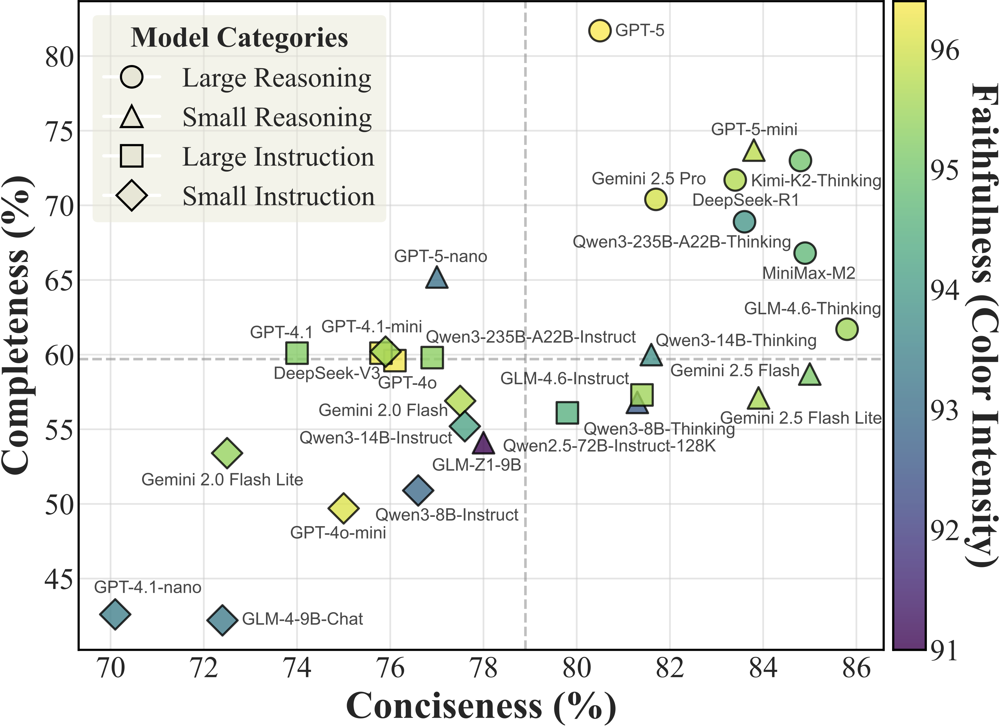

# OmniCSEval

This repository provides the benchmark data, evaluation results, and scripts for reproducing the main analyses in our paper *"A Large-Scale Multi-Dimensional Empirical Study of LLMs for Conversation Summarization"*.

<p align="center">
  
</p>

## Repository Structure

```text
OmniCSEval/
├── benchmark/
├── main-evaluation/
├── meta-evaluation/
├── scripts/
│   ├── compute_quality_metrics.py
│   ├── compute_stability_robustness.py
│   └── compute_alignment_with_humans.py
├── requirements.txt
├── LICENSE
└── README.md
```

The released resources include:

- `benchmark/`: OmniCSEval benchmark samples.
- `main-evaluation/`: model summary outputs and automatic evaluation results for the main benchmark.
- `meta-evaluation/`: meta-evaluation data, including human alignment and stability/robustness analyses.
- `scripts/`: scripts for reproducing the reported metrics.

The benchmark contains conversation summarization samples across multiple domains and scenarios. The evaluation focuses on three dimensions: completeness, conciseness, and faithfulness.

## Data Download

Please download `benchmark.tar.gz`, `main-evaluation.tar.gz`, and `meta-evaluation.tar.gz` into `benchmark/`, `main-evaluation/`, and `meta-evaluation/`, respectively.

| Archive | Google Link | Baidu Link |
| --- | --- | --- |
| `benchmark.tar.gz` | [Google Drive](https://drive.google.com/file/d/1cCAs6nFMex3ROzNDjNxJJy-f-5r52ZaJ/view?usp=sharing) | [Baidu Netdisk](https://pan.baidu.com/s/1FP2OGZ7s51oLBlAZ_nJp1g?pwd=mudi) (`mudi`) |
| `main-evaluation.tar.gz` | [Google Drive](https://drive.google.com/file/d/1uOr1HnavQOU1HIIL9g5GP-5ebz7A43je/view?usp=sharing) | [Baidu Netdisk](https://pan.baidu.com/s/1RA8j9lqrPudNDVB6JlB9XQ?pwd=knak) (`knak`) |
| `meta-evaluation.tar.gz` | [Google Drive](https://drive.google.com/file/d/1R8Xp2cZdvNF46YZGaI5cS4QJQHZMxNEG/view?usp=sharing) | [Baidu Netdisk](https://pan.baidu.com/s/16EKGuqPtKD4fbFx3UiePOQ?pwd=q3gu) (`q3gu`) |

After downloading the archives, extract them with:

```bash
tar -xzvf benchmark.tar.gz -C . && rm benchmark.tar.gz
tar -xzvf main-evaluation.tar.gz -C . && rm main-evaluation.tar.gz
tar -xzvf meta-evaluation.tar.gz -C . && rm meta-evaluation.tar.gz
```

## Environment

Create and activate the environment with:

```bash
conda create -n omnicseval python=3.9 -y
conda activate omnicseval
pip install -r requirements.txt
```

## Evaluation Results

### Main Evaluation

```bash
python scripts/compute_quality_metrics.py
```

This script computes the main quality metrics: Completeness, Conciseness, and Faithfulness.

### Stability and Robustness

```bash
python scripts/compute_stability_robustness.py
```

This script computes evaluation stability and leaderboard robustness across different LLM judges.

### Alignment with Humans

```bash
python scripts/compute_alignment_with_humans.py
```

This script computes the agreement between automated evaluation and human annotations.

## Citation

If you find our work useful, please cite:

```bibtex
@misc{zhou2026largescalemultidimensionalempiricalstudy,
      title={A Large-Scale Multi-Dimensional Empirical Study of LLMs for Conversation Summarization}, 
      author={Weixiao Zhou and Gengyao Li and Xianfu Cheng and Junnan Zhu and Feifei Zhai and Zhoujun Li},
      year={2026},
      eprint={2606.15974},
      archivePrefix={arXiv},
      primaryClass={cs.CL},
      url={https://arxiv.org/abs/2606.15974}, 
}
```
